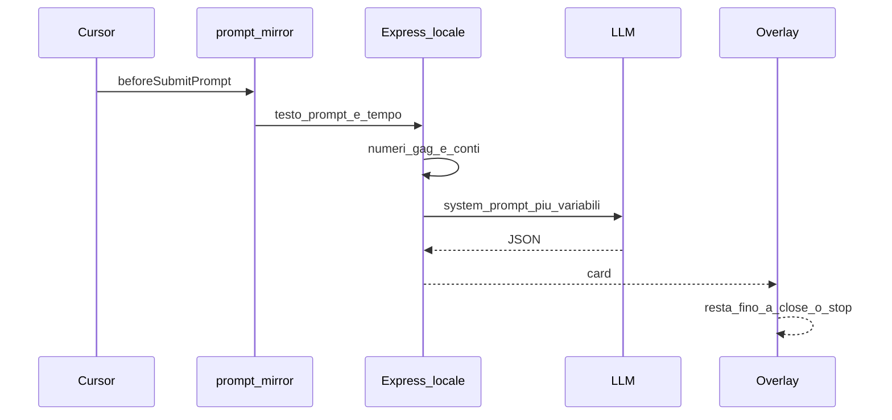

# Ai-Ando — Documento di progetto

> **Stato del documento:** descrive prodotto e architettura target per la v1 personale su macOS.  
> **Contratto LLM:** le regole di tono, limiti e schema JSON restano in [`prompts/ai-ando-system-prompt.md`](../prompts/ai-ando-system-prompt.md). Questo file non le duplica: le riassume e le collega al flusso.

---

## 1. Cos’è

**Ai-Ando** è un “wrapped” istantaneo stile TikTok italiano Gen Z che compare nei **momenti morti** mentre lavori in Cursor: appena invii un prompt all’agente, un overlay a schermo intero ti mostra battute, numeri e un prompt riscritto — invece di fissare la chat in attesa.

Il nome gioca sull’idea di **“Ai-Ando”** (stare a chiacchierare con l’AI invece di fare il lavoro vero). Il tono è affettuosamente tossico verso il *prompt* e l’abitudine, mai verso la persona.

### Cosa mostra (in sintesi)

| Sezione | Contenuto |
|--------|-----------|
| **Cloni** | Quante “altre persone” avrebbero scritto lo stesso prompt (v1: numero da gag) |
| **Fun fact** | Curiosità ridicola o paragone ironico libro/film/meme sul testo |
| **Soldi a gratis** | Quanto “stipendio” ti stai prendendo mentre l’AI lavora al posto tuo |
| **Invece potevi** | 3–4 attività stupide fattibili nei secondi spesi sul prompt |
| **Classifica** | Posizione nella “classifica Ai-Ando” (v1: finta, locale) |
| **Prompt migliore** | Versione più corta ed efficace del prompt originale |

---

## 2. Per chi, e cosa non è

### v1 — scope

- **Un solo utente:** tu, sul **Mac**, con **Cursor**.
- **Nessun account**, nessun backend condiviso, **nessuna classifica globale reale**.
- Numeri tipo “48.213 cloni” e “1323° su 8741” sono **gag calcolate in locale**; l’LLM deve usarle **esattamente** come ricevute, senza inventarne.

### Fuori scope v1

- App installabile per altri utenti con leaderboard condivisa.
- Conteggio reale di prompt simili (embedding / similarity).
- Classifica ordinata per token totali su base utenti reali.
- Windows / Linux (l’overlay attuale è AppKit + WebKit su macOS).

---

## 3. Momento dell’esperienza

### Trigger

L’esperienza parte su **`beforeSubmitPrompt`**: l’hook Cursor riceve il testo (e metadati) del prompt **prima** che l’agente inizi a lavorare.

### Durata dell’overlay

L’overlay **completo** (tutte le card) resta visibile fino al **primo** di questi eventi:

1. **Chiusura esplicita** — es. tasto Esc o pulsante “Chiudi” sull’overlay.
2. **Fine agente** — eventi hook equivalenti a fine turno: risposta dell’agente e/o `stop`.

Non è obbligatorio che l’overlay copra l’intera durata della generazione se l’utente lo chiude prima; l’importante è che **non sparisca da solo in pochi secondi** come un flash decorativo.

### Stato attuale vs bersaglio

| Aspetto | Oggi nel repo | Bersaglio v1 |
|--------|----------------|--------------|
| Hook su submit | Sì (`prompt-mirror.py` logga eventi) | Stesso hook + chiamata al server locale |
| Overlay | Flash del testo del prompt, click-through, auto-dismiss | UI con tutte le sezioni Ai-Ando, **chiudibile**, interazione minima (chiudi / scroll card) |
| Contenuto | Solo echo del prompt | JSON dal backend (LLM + numeri) |

Riferimenti codice:

- Hook: [`prompt-overlay/hooks.json`](../prompt-overlay/hooks.json), [`prompt-overlay/hooks/prompt-mirror.py`](../prompt-overlay/hooks/prompt-mirror.py)
- Overlay macOS: [`prompt-overlay/hooks/prompt-overlay.py`](../prompt-overlay/hooks/prompt-overlay.py), [`prompt-overlay/Sources/PromptOverlay/OverlayPage.html`](../prompt-overlay/Sources/PromptOverlay/OverlayPage.html)

---

## 4. Cosa si vede in UI

Il backend (dopo la chiamata LLM) espone un oggetto allineato allo schema in [`prompts/ai-ando-system-prompt.md`](../prompts/ai-ando-system-prompt.md).

### Campi principali

- `roast_mode` — `true` per tono Gen Z / roast; `false` se il prompt tocca temi seri (lutto, salute, crisi, autolesionismo): in quel caso niente insulti, tono gentile.
- `cloni` — frase sull’“originalità zero” usando `similar_count`.
- `fun_fact_frase` — fun fact ironico sul testo (lunghezza, “per favore” all’AI, typo, paragone assurdo a libro/film/meme).
- `soldi_gratis` — gag stipendio usando `prompts_per_day`, `euro_per_day`, `euro_per_month`.
- `invece_potevi` — array di 3–4 stringhe legate a `seconds_spent`.
- `classifica` — frase con `leaderboard_rank`, `leaderboard_total`, `people_above`.
- `prompt_migliore` — rewrite del prompt utente.
- `commento_prompt_migliore` — battuta sul rewrite.

### Casi speciali

- **Segreti nel prompt** (password, API key, dati personali): non ripetere il segreto; mostrare avviso (“hai incollato una API key…”) — regola nel system prompt, enforcement lato server prima dell’invio all’LLM dove possibile.
- **`roast_mode: false`**: UI senza tono aggressivo; stesse sezioni informative dove ha senso (es. prompt migliore sì, classifica roast no o attenuata).

---

## 5. Tono e limiti

Dettaglio completo nel system prompt. In sintesi per il prodotto:

- Italiano parlato, Gen Z, ritmo veloce, emoji con moderazione.
- Insulti leggeri **solo** verso prompt / abitudine Ai-Ando, mai verso aspetto fisico, genere, origine, religione, salute mentale, ecc.
- Fun fact su libri/film/canzoni: **ironico e inventato**, niente citazioni lunghe (max poche parole).
- **Numeri:** solo quelli passati dal backend; random e classifica finta **non** li genera il modello.

---

## 6. Architettura

### Diagramma di flusso (target v1)



### Componenti nel repository

| Componente | Ruolo | Stato oggi |
|------------|--------|------------|
| **Cursor hooks** | Intercettano prompt, tool, risposta, stop; log JSONL | Attivo: [`prompt-mirror.py`](../prompt-overlay/hooks/prompt-mirror.py) scrive in `~/.cursor/prompt-mirror/events.jsonl` |
| **Server Express** | API locale per wrapped | Scheletro: [`server/src/app.ts`](../server/src/app.ts), `POST /api/...` che logga body ([`text.routes.ts`](../server/src/routes/text.routes.ts)) |
| **Motore numeri + LLM** | Calcola variabili, chiama provider, valida JSON | **Da implementare** (vedi §7) |
| **Overlay AppKit/WebKit** | Finestra fullscreen sopra Cursor | Parziale: animazione prompt, non card Ai-Ando |

### Percorsi dati locali

Il documento **non scrive** questi file; li descrive per l’architettura. Formato indicativo (valori sintetici):

**`~/.cursor/prompt-mirror/events.jsonl`** — una riga JSON per evento, es.:

```json
{"ts": "2026-09-25T19:00:00+02:00", "kind": "prompt", "text": "…", "hook": "beforeSubmitPrompt"}
```

**`~/.cursor/prompt-mirror/timing.json`** — stato sessione per durata prompt, es.:

```json
{"started_at": 1727283600.5, "prompt_id": "…"}
```

Gli hook devono restare **non bloccanti** per la chat (`failClosed: false`, timeout breve negli hook): se il server o l’LLM falliscono, Cursor continua; l’overlay può mostrare fallback o non aprirsi.

---

## 7. Chi calcola cosa

### Backend locale (Express) — numeri e variabili

Il backend **inietta** le variabili `{{...}}` del system prompt **prima** della chiamata LLM. Regola d’oro: **l’LLM non inventa numeri.**

| Variabile | v1 — origine |
|-----------|----------------|
| `user_prompt` | Testo dal hook |
| `token_count` | Stima locale (es. caratteri/4 o tokenizer leggero) |
| `similar_count` | `randomInt(1, 5342534)` — gag |
| `seconds_spent` | Da `timing.json` / differenza timestamp prompt submit |
| `prompts_per_day` | Conteggio prompt di oggi da `events.jsonl`, altrimenti default configurabile |
| `hourly_wage` | Config (default **15,50** EUR) |
| `euro_per_day` | `prompts_per_day * seconds_spent / 3600 * hourly_wage` (per v1: tempo utente sul prompt) |
| `euro_per_month` | `euro_per_day * ~22` (o giorni lavorativi configurabili) |
| `leaderboard_rank` | Random o formula fissa da profilo locale — gag |
| `leaderboard_total` | Costante o random plausibile — gag |
| `people_above` | `rank - 1` |

### LLM esterno — solo testo

- **Provider:** non fissato nel progetto; scelta via variabili d’ambiente (es. OpenAI, Anthropic, altro compatibile chat/completions).
- **Input:** system prompt da [`prompts/ai-ando-system-prompt.md`](../prompts/ai-ando-system-prompt.md) con variabili sostituite.
- **Output:** solo JSON valido con lo schema definito lì.
- **Parametri suggeriti:** `temperature` ~ **0.9** per varietà; **retry** se JSON non parsabile.

### Server — endpoint target (concettuale)

- `POST /api/wrapped` (nome indicativo): body `{ "prompt": "…", "sessionId": "…" }` → risposta con le chiavi `roast_mode`, `cloni`, `fun_fact_frase`, ecc.
- Validazione JSON in uscita dall’LLM; cache opzionale per stesso prompt hash (fuori scope se non serve).

---

## 8. Privacy e sicurezza

- Il **testo del prompt** esce dal Mac verso l’**API del provider LLM** scelto: va trattato come dato sensibile di lavoro.
- **Prima dell’invio all’LLM:** rilevare pattern grossolani (API key, password, token lunghi) e **non inoltrare** il segreto; rispondere con messaggio di avviso (coerente col system prompt).
- **v1:** nessuna telemetria verso server di terzi oltre al provider LLM; log solo locale (`events.jsonl`, log server dev).
- Chiavi API del provider: solo in `.env` locale ([`server/.env.example`](../server/.env.example) come riferimento), mai committate.

---

## 9. Dopo la v1 (roadmap breve)

Non fa parte del deliverable v1; elencati per allineamento futuro:

1. **Classifica reale** multi-utente, ordinata per token totali inviati.
2. **`similar_count` reale** via embedding similarity su corpus prompt (opt-in).
3. **Distribuzione** hook + server + overlay per altri utenti Cursor su macOS.
4. **Provider LLM** opzionale self-hosted per prompt che non devono uscire dalla rete.

---

## 10. Riepilogo implementazione

| Area | Già nel repo | Prossimo passo |
|------|----------------|----------------|
| Intercettazione Cursor | Hook + log | Chiamata HTTP al server su submit |
| Server | Express + health + log POST | Route wrapped, calcolo variabili, client LLM, validazione JSON |
| Overlay | Flash prompt | Pagina card Ai-Ando, dismiss Esc/button, listen fine agente |
| Prompt / tono | System prompt completo | Iniezione variabili + test con prompt reali |

---

## Riferimenti rapidi

- System prompt LLM: [`prompts/ai-ando-system-prompt.md`](../prompts/ai-ando-system-prompt.md)
- Config server: [`server/src/config.ts`](../server/src/config.ts)
- Docker locale (opzionale): [`server/docker-compose.yml`](../server/docker-compose.yml)
