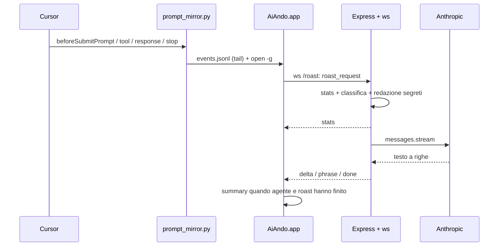

# Ai-Ando — Documento di progetto

> **Stato del documento:** descrive prodotto e architettura della v1 personale su macOS, aggiornato al commit che introduce l'app Swift `AiAndo/`.  
> **Contratto LLM:** le regole di tono, limiti e formato di output restano in [`prompts/ai-ando-system-prompt.md`](../prompts/ai-ando-system-prompt.md). Questo file non le duplica: le riassume e le collega al flusso.  
> **Protocollo app ↔ server:** [`AiAndo/WEBSOCKET_PROTOCOL.md`](../AiAndo/WEBSOCKET_PROTOCOL.md).  
> **Piano hackathon (server vero + classifica LAN):** [`docs/superpowers/specs/2026-09-25-ai-ando-server-lan-leaderboard-design.md`](superpowers/specs/2026-09-25-ai-ando-server-lan-leaderboard-design.md).

---

## 1. Cos'è

**Ai-Ando** è un "wrapped" istantaneo stile TikTok italiano Gen Z che compare nei **momenti morti** mentre lavori in Cursor: appena invii un prompt all'agente, un overlay a schermo intero ti mostra battute, numeri e un prompt riscritto — invece di fissare la chat in attesa.

Il nome gioca sull'idea di **"Ai-Ando"** (stare a chiacchierare con l'AI invece di fare il lavoro vero). Il tono è affettuosamente tossico verso il *prompt* e l'abitudine, mai verso la persona.

### Cosa mostra (in sintesi)

| Sezione | Contenuto |
|--------|-----------|
| **Cloni** | Quante "altre persone" avrebbero scritto lo stesso prompt (numero da gag) |
| **Fun fact** | Curiosità ridicola o paragone ironico libro/film/meme sul testo |
| **Soldi a gratis** | Quanto "stipendio" ti stai prendendo mentre l'AI lavora al posto tuo |
| **Invece potevi** | 3–4 attività stupide fattibili nei secondi spesi sul prompt |
| **Classifica** | Posizione nella "classifica Ai-Ando" (reale tra chi usa lo stesso server, con bot di riempimento) |
| **Prompt migliore** | Versione più corta ed efficace del prompt originale |
| **Wrapped finale** | A fine turno dell'agente: grafico tempo AI vs tempo tuo, conteggio tool e pensieri, classifica |

---

## 2. Per chi, e cosa non è

### v1 — scope

- **Mac + Cursor.** Un'app da barra menu (`AiAndo.app`) per ogni utente.
- **Nessun account.** L'identità nella classifica è un nome libero (`user`), non verificato.
- **Server locale o in LAN.** Chi non configura un server vede un roast mock generato in locale: l'app funziona anche da sola.
- **Classifica reale solo tra chi punta allo stesso server**, in memoria e su un JSON locale del server. Nessuna classifica globale.
- Numeri tipo "48.213 cloni" sono **gag calcolate dal server**; l'LLM deve usarli **esattamente** come ricevuti, senza inventarne.

### Fuori scope v1

- Backend pubblico condiviso, account, classifica globale.
- Conteggio reale di prompt simili (embedding / similarity).
- Windows / Linux (l'overlay è AppKit + SwiftUI su macOS 14+).

---

## 3. Momento dell'esperienza

### Trigger

L'esperienza parte su **`beforeSubmitPrompt`**: l'hook Cursor riceve il testo del prompt **prima** che l'agente inizi a lavorare, lo scrive nel log eventi e si assicura che `AiAndo.app` sia in esecuzione (`open -g`, senza rubare il focus a Cursor).

### Fasi dell'overlay

| Fase | Cosa si vede | Quando finisce |
|------|--------------|----------------|
| **Intro** | Animazione con il testo del prompt | Dopo ~2,6 s |
| **Roasting** | Le card arrivano in streaming mentre l'agente lavora; ticker con l'attività dell'agente ("sta leggendo i tuoi file spaghetti") | Quando **sia** il roast **sia** l'agente hanno finito |
| **Summary** | Wrapped finale con grafici | Chiusura esplicita (Esc o pulsante "Chiudi") |

L'overlay **non sparisce da solo**: resta fino alla chiusura esplicita. Un nuovo prompt riparte dall'intro.

### Riferimenti codice

- Hook: [`prompt-overlay/hooks.json`](../prompt-overlay/hooks.json), [`prompt-overlay/hooks/prompt-mirror.py`](../prompt-overlay/hooks/prompt-mirror.py)
- App macOS: [`AiAndo/Sources/AiAndo/App/Coordinator.swift`](../AiAndo/Sources/AiAndo/App/Coordinator.swift) (orchestrazione), [`AiAndo/Sources/AiAndo/Input/EventLogWatcher.swift`](../AiAndo/Sources/AiAndo/Input/EventLogWatcher.swift) (tail del log), [`AiAndo/Sources/AiAndo/UI/`](../AiAndo/Sources/AiAndo/UI/) (overlay)
- Overlay legacy WebKit ([`prompt-overlay/hooks/prompt-overlay.py`](../prompt-overlay/hooks/prompt-overlay.py)): usato solo se `~/Applications/AiAndo.app` non esiste

---

## 4. Cosa si vede in UI

Il server manda all'app, sulla stessa connessione WebSocket, prima i **numeri** (`stats`) e poi il **testo** sezione per sezione (`delta` / `phrase`). Le chiavi di sezione sono le stesse del system prompt.

### Sezioni

- `cloni` — frase sull'"originalità zero" usando `similar_count`.
- `fun_fact_frase` — fun fact ironico sul testo (lunghezza, "per favore" all'AI, typo, paragone assurdo a libro/film/meme).
- `soldi_gratis` — gag stipendio usando `prompts_per_day`, `euro_per_day`, `euro_per_month`.
- `invece_potevi` — 3–4 voci legate a `seconds_spent` (una `phrase` per voce).
- `classifica` — frase con `leaderboard_rank`, `leaderboard_total`, `people_above`.
- `prompt_migliore` — rewrite del prompt utente.
- `commento_prompt_migliore` — battuta sul rewrite.

### Casi speciali

- **Segreti nel prompt** (password, API key, token): il server li sostituisce con `[SEGRETO_RIMOSSO]` **prima** di chiamare l'LLM e gli segnala cosa ha trovato; l'LLM avvisa l'utente ("hai incollato una API key…") senza ripetere il valore.
- **Temi seri** (lutto, salute, crisi, autolesionismo): l'LLM abbandona il roast e usa un tono gentile. Non c'è un flag sul protocollo: cambia solo il testo.
- **Server assente o in errore:** l'app usa il mock locale (stesso layout, battute fisse). Se il server risponde ma l'LLM fallisce, il server manda un roast template con i numeri veri.

---

## 5. Tono e limiti

Dettaglio completo nel system prompt. In sintesi per il prodotto:

- Italiano parlato, Gen Z, ritmo veloce, emoji con moderazione.
- Insulti leggeri **solo** verso prompt / abitudine Ai-Ando, mai verso aspetto fisico, genere, origine, religione, salute mentale, ecc.
- Fun fact su libri/film/canzoni: **ironico e inventato**, niente citazioni lunghe (max poche parole).
- **Numeri:** solo quelli passati dal server; random e classifica **non** li genera il modello.

---

## 6. Architettura

### Diagramma di flusso



### Componenti nel repository

| Componente | Ruolo | Stato oggi |
|------------|--------|------------|
| **Cursor hooks** (`prompt-overlay/`) | Intercettano prompt, tool, risposta, stop; log JSONL; lanciano l'app | Attivo |
| **App Swift** (`AiAndo/`) | Menu bar app; overlay con fasi intro/roasting/summary; client WebSocket con fallback mock; wrapped finale con grafici | Completa |
| **Server Express** (`server/`) | `GET /api/health`; `POST /api/text` che logga il body | Scheletro |
| **Server roast** (`server/src/roast/`) | WebSocket `/roast`, numeri, classifica, redazione segreti, client LLM, parser streaming | **Da implementare** (spec in `docs/superpowers/specs/`) |

### Percorsi dati locali

**`~/.cursor/prompt-mirror/events.jsonl`** — una riga JSON per evento, scritta dall'hook e letta in tail dall'app:

```json
{"ts": "2026-09-25T19:00:00+02:00", "kind": "prompt", "text": "…", "hook": "beforeSubmitPrompt", "conversation_id": "…"}
```

**`~/.cursor/prompt-mirror/timing.json`** — stato per calcolare `duration_ms` di tool e turno (usato dall'hook, non dal server).

**`server/data/leaderboard.json`** — classifica persistita dal server (non committata).

Gli hook restano **non bloccanti** per la chat (`failClosed: false`, timeout 2 s): se app, server o LLM falliscono, Cursor continua.

### Configurazione dell'app

L'app legge l'URL del server da `AIANDO_WS_URL` (env) oppure da UserDefaults `wsURL`. Quando l'app viene lanciata dall'hook con `open -g` **l'ambiente della shell non arriva**: in pratica si usa

```bash
defaults write com.aiando.overlay wsURL ws://<ip-server>:3000/roast
```

Senza `wsURL` l'app usa il mock locale.

---

## 7. Chi calcola cosa

### Server — numeri e variabili

Il server **inietta** le variabili `{{...}}` del system prompt **prima** della chiamata LLM. Regola d'oro: **l'LLM non inventa numeri.**

| Variabile | Origine |
|-----------|---------|
| `user_prompt` | Testo dalla `roast_request`, redatto dai segreti |
| `token_count` | Dal client se > 0, altrimenti `ceil(caratteri / 4)` |
| `similar_count` | `randomInt(1, 5342534)` — gag |
| `seconds_spent` | Stima dalla lunghezza del prompt (`caratteri / 3,5 + 2–6 s`) — gag |
| `prompts_per_day` | `max(prompt di oggi dell'utente sul server, 60)` |
| `hourly_wage` | Config (default **15,50** EUR) |
| `euro_per_day` | `prompts_per_day * seconds_spent / 3600 * hourly_wage` |
| `euro_per_month` | `euro_per_day * 22` |
| `leaderboard_rank`, `leaderboard_total`, `people_above` | Classifica reale del server (utenti + bot fissi); `people_above = rank - 1` |
| `leaderboard` | Top 5 + vicini dell'utente, max 8 voci |

### LLM — solo testo

- **Provider:** Anthropic, SDK `@anthropic-ai/sdk`, modello `claude-opus-5` (config `AIANDO_MODEL`), `effort: low` per latenza.
- **Input:** system prompt fisso da [`prompts/ai-ando-system-prompt.md`](../prompts/ai-ando-system-prompt.md) + blocco variabili nel messaggio utente.
- **Output:** testo a righe con header `### <sezione>`, inoltrato in streaming all'app. Il formato JSON del prompt originale viene sostituito da questo (vedi spec §8.3).
- **Parametri:** nessuna `temperature` (rifiutata dal modello); varietà via prompt. Timeout primo token 15 s, poi fallback template.

---

## 8. Privacy e sicurezza

- Il **testo del prompt** esce dal Mac verso il **server** (locale o di un collega in LAN) e da lì verso l'**API Anthropic**: va trattato come dato sensibile di lavoro. In modalità LAN chi ospita il server vede i prompt degli altri nei log di sviluppo.
- **Prima dell'invio all'LLM** il server rileva pattern grossolani (API key, password, token lunghi, chiavi private) e li sostituisce; il valore originale non viene loggato dal server.
- Il log locale `events.jsonl` contiene i prompt in chiaro (troncati a 4000 caratteri): resta sul Mac dell'utente.
- Chiave Anthropic: solo in `server/.env` (vedi [`server/.env.example`](../server/.env.example)), mai committata.

---

## 9. Dopo la v1 (roadmap breve)

1. Classifica per giornata / reset, e pagina "proiettore" (`GET /leaderboard`) per eventi.
2. `similar_count` reale via embedding similarity su corpus prompt (opt-in).
3. Distribuzione hook + app per altri utenti Cursor su macOS.
4. Provider LLM self-hosted per prompt che non devono uscire dalla rete.
5. Verdetto post-agente: roast del lavoro dell'agente ("14 file letti per cambiare un colore") dai dati del summary.

---

## 10. Riepilogo implementazione

| Area | Già nel repo | Prossimo passo |
|------|----------------|----------------|
| Intercettazione Cursor | Hook + log + lancio app | — |
| App Swift | Overlay completo, client WS, mock, summary | Campo `user` nella `roast_request` |
| Server | Express + health + log POST | `/roast` WebSocket, stats, classifica, segreti, client Anthropic streaming, parser a righe, fallback |
| Prompt / tono | System prompt completo (output JSON) | Output a righe `### sezione`, rimozione nota su `temperature`, esempio riscritto |

---

## Riferimenti rapidi

- System prompt LLM: [`prompts/ai-ando-system-prompt.md`](../prompts/ai-ando-system-prompt.md)
- Protocollo WebSocket: [`AiAndo/WEBSOCKET_PROTOCOL.md`](../AiAndo/WEBSOCKET_PROTOCOL.md)
- Spec server + classifica LAN: [`docs/superpowers/specs/2026-09-25-ai-ando-server-lan-leaderboard-design.md`](superpowers/specs/2026-09-25-ai-ando-server-lan-leaderboard-design.md)
- Config server: [`server/src/config.ts`](../server/src/config.ts)
- Build app: [`AiAndo/scripts/build-app.sh`](../AiAndo/scripts/build-app.sh)
- Docker locale (opzionale): [`server/docker-compose.yml`](../server/docker-compose.yml)
