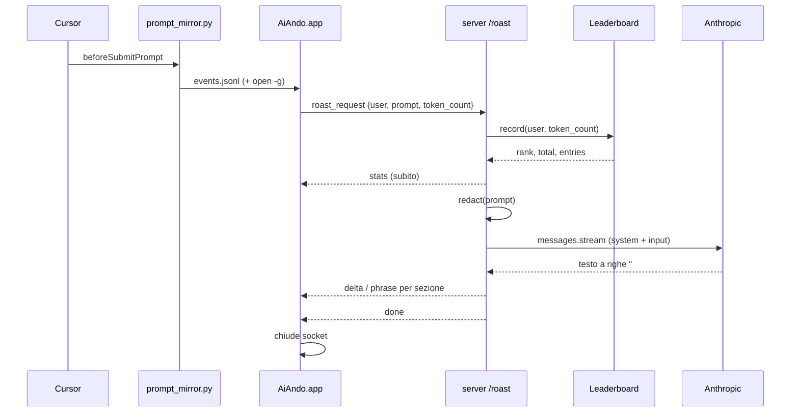

# Ai-Ando — Server roast reale + classifica LAN (design hackathon 2h)

> **Stato:** design approvato in chat, da implementare.  
> **Obiettivo:** sostituire il mock locale dell'app Swift con un server vero (WebSocket + LLM streaming) e rendere la classifica reale per tutte le persone in sala che puntano allo stesso server.  
> **Vincolo:** deve stare in 2 ore con 2-3 persone. Tutto ciò che non serve alla demo è fuori scope.

Riferimenti: [`docs/ai-ando.md`](../../ai-ando.md) (prodotto), [`AiAndo/WEBSOCKET_PROTOCOL.md`](../../../AiAndo/WEBSOCKET_PROTOCOL.md) (protocollo), [`prompts/ai-ando-system-prompt.md`](../../../prompts/ai-ando-system-prompt.md) (tono e regole LLM).

---

## 1. Punto di partenza

| Componente | Stato oggi |
|---|---|
| Hook Cursor (`prompt-overlay/hooks/prompt-mirror.py`) | Logga eventi in `~/.cursor/prompt-mirror/events.jsonl` e lancia `~/Applications/AiAndo.app` con `open -g` |
| App Swift (`AiAndo/`) | Completa: tail del log, overlay intro → roasting → summary con grafici, client WebSocket con fallback a mock |
| Server (`server/`) | Scheletro Express 5: `GET /api/health`, `POST /api/text` che logga il body. Nessun WebSocket, nessun LLM |

Il client è già pronto a parlare con `ws://host:3000/roast` secondo `WEBSOCKET_PROTOCOL.md`. Il lavoro è quasi tutto lato server, più una modifica minima al client per l'identità utente.

---

## 2. Scope

### Dentro

1. Endpoint WebSocket `/roast` sullo stesso `http.Server` di Express.
2. Calcolo di tutte le `stats` lato server e invio **immediato** (prima della chiamata LLM).
3. Chiamata Anthropic in streaming, output a righe, inoltro come frame `delta` / `phrase`.
4. Classifica reale in memoria per utente (persistita in un JSON), con bot fissi come riempitivo.
5. Campo `user` nella `roast_request` (client Swift + protocollo).
6. Redazione grossolana di segreti prima dell'invio all'LLM.
7. Fallback a roast template lato server se l'LLM fallisce.

### Fuori (esplicitamente)

- Voce / TTS.
- Classifica per giorno, reset, account, autenticazione.
- `similar_count` reale (resta random).
- Cache per prompt uguale.
- Deploy remoto: il server gira sul laptop di un membro del team, in LAN.

---

## 3. Architettura



### 3.1 Struttura file server

```
server/src/
  index.ts              # http.createServer(app) + attachRoastSocket(server)
  config.ts             # + anthropicModel, hourlyWage, promptsPerDayMin, botsEnabled, host
  roast/
    socket.ts           # upgrade su /roast, un handler per connessione, invio frame
    stats.ts            # computeStats(request, leaderboardSnapshot) -> stats
    leaderboard.ts      # store in memoria + JSON su disco, bot, snapshot(user)
    secrets.ts          # redact(prompt) -> { text, found }
    llm.ts              # streamRoast(vars, onText): Anthropic streaming
    sectionParser.ts    # parser a righe: testo -> {section, kind, text}
    fallback.ts         # roast template dalle stats se l'LLM fallisce
    systemPrompt.ts     # carica prompts/ai-ando-system-prompt.md, sostituisce {{...}}
server/test/
  sectionParser.test.ts
  leaderboard.test.ts
  stats.test.ts
server/scripts/
  ws-smoke.ts           # connette, manda una roast_request, stampa i frame
```

Dipendenze da aggiungere: `ws`, `@types/ws`, `@anthropic-ai/sdk`. Test con `node:test` (nessuna dipendenza).

### 3.2 Unità e responsabilità

| Unità | Fa | Dipende da |
|---|---|---|
| `socket.ts` | Accetta upgrade su `/roast`, valida `roast_request`, orchestra: record → stats → redact → llm → frame → `done`, chiude | tutte le altre |
| `leaderboard.ts` | `record(user, tokens)`, `snapshot(user)` → `{rank, total, entries}`; scrive `server/data/leaderboard.json` a ogni record | fs |
| `stats.ts` | Formule dei numeri gag | `leaderboard` snapshot |
| `secrets.ts` | Regex, sostituisce con `[SEGRETO_RIMOSSO]` | — |
| `systemPrompt.ts` | Legge il file prompt una volta, separa parte fissa (system) e blocco input (user message) | fs |
| `llm.ts` | Apre lo stream Anthropic, chiama `onText(delta)` per ogni chunk | SDK |
| `sectionParser.ts` | Stato: sezione corrente + buffer riga. Emette `delta` o `phrase` | — |
| `fallback.ts` | Frasi fisse con i numeri delle stats | — |

Ogni unità è testabile da sola: il parser riceve stringhe, la leaderboard riceve `(user, tokens)`, le stats ricevono numeri.

---

## 4. Protocollo: modifiche

Unica modifica a `WEBSOCKET_PROTOCOL.md`: nuovo campo **`user`** (stringa, obbligatorio per il client nuovo) in `roast_request`.

```json
{"type":"roast_request","session_id":"…","conversation_id":null,"user":"marco","prompt":"…","token_count":19,"model":null}
```

Server: se `user` manca o è vuoto (client vecchio) usa `"anon-" + session_id.slice(0,4)`.

Nessun cambiamento ai frame server → client. `roast_mode` **non** viaggia sul wire: se il prompt tocca temi seri l'LLM cambia solo il tono del testo.

---

## 5. Server: flusso per connessione

1. Upgrade HTTP su path `/roast`; altri path → 404 e socket distrutto.
2. Primo messaggio: parse JSON, `type === "roast_request"`, `prompt` stringa non vuota, max 4000 caratteri (oltre: tronca). Altrimenti `error` + close.
3. `tokenCount = request.token_count > 0 ? request.token_count : ceil(prompt.length / 4)`.
4. `leaderboard.record(user, tokenCount)` → `snapshot(user)`.
5. `stats = computeStats(...)` → invia frame `stats` **subito** (protegge dal timeout client di 20 s).
6. `redact(prompt)` → testo redatto + lista pattern trovati.
7. `llm.streamRoast(vars, chunk => parser.feed(chunk))`; il parser chiama `send(delta|phrase)`.
8. Fine stream: `parser.flush()`, invia `done`, chiude.
9. Errori LLM (eccezione, `stop_reason === "refusal"`, nessun testo entro 15 s):
   - se nessuna sezione inviata → invia il roast di `fallback.ts` come `phrase` per ogni sezione, poi `done`;
   - se già inviate sezioni → `done` comunque (il client mostra ciò che ha).
   - Loggare sempre l'errore in console.
10. Chiusura client anticipata → `AbortController` sullo stream LLM.

Un solo `roast_request` per connessione. Messaggi successivi ignorati.

---

## 6. Numeri (`stats.ts`)

| Campo | Formula |
|---|---|
| `token_count` | dal client se > 0, altrimenti `ceil(chars / 4)` |
| `similar_count` | `randomInt(1, 5_342_534)` |
| `seconds_spent` | `max(3, round(chars / 3.5 + randomInt(2, 6)))` (stessa gag del mock) |
| `prompts_per_day` | `max(prompts di oggi dell'utente sul server, PROMPTS_PER_DAY_MIN=60)` |
| `hourly_wage` | config, default `15.5` |
| `euro_per_day` | `round2(prompts_per_day * seconds_spent / 3600 * hourly_wage)` |
| `euro_per_month` | `round2(euro_per_day * 22)` |
| `leaderboard_rank` / `leaderboard_total` / `people_above` | dallo snapshot; `people_above = rank - 1` |
| `leaderboard` | vedi §7 |

Nessun numero viene generato dall'LLM: i valori entrano nel blocco input del prompt e devono essere ripetuti così come sono.

---

## 7. Classifica LAN (`leaderboard.ts`)

- **Chiave:** `user.trim().toLowerCase()`.
- **Stato per utente:** `{ name, tokens, prompts, lastSeen, today: { date, prompts } }`.
- **Persistenza:** `server/data/leaderboard.json` riscritto a ogni `record` (sync, file piccolo). Caricato all'avvio. Il file è in `.gitignore`.
- **Bot:** se `AIANDO_BOTS=true` (default), 5 voci fisse aggiunte allo snapshot, mai persistite:
  `xX_vibecoder_Xx 900271`, `promptmaxxing 431002`, `stagista_ai 120500`, `senior_dev_stanco 44100`, `nonna_pina 9800`.
  Servono a non avere una classifica vuota con 1-2 persone e a dare qualcuno da superare.
- **Snapshot(user):** ordina tutti (reali + bot) per `tokens` desc; `rank` = posizione 1-based dell'utente; `total` = numero voci; `entries` = top 5 ∪ {rank-1, rank, rank+1}, deduplicati, ordinati desc, `is_me` sull'utente. Max 8 voci.
- **Pareggi:** ordine stabile per `lastSeen` (chi ha scritto prima sta sopra).

### 7.1 Setup in sala

- Server in ascolto su `0.0.0.0:3000` (config `HOST`). Al primo avvio macOS chiede di consentire connessioni in entrata: accettare.
- Ogni partecipante: `defaults write com.aiando.overlay wsURL ws://<ip-del-server>:3000/roast`, poi riavvio dell'app (`pkill AiAndo`; l'hook la rilancia al prossimo prompt).
- **Perché UserDefaults e non env:** l'hook lancia l'app con `open -g`, che eredita l'ambiente di launchd e non della shell. `AIANDO_WS_URL` funziona solo lanciando il binario a mano.
- Chi non imposta `wsURL` resta sul mock locale: nessuna rottura.

### 7.2 Pagina proiettore (stretch, solo se avanza tempo)

`GET /leaderboard`: HTML statico con fetch di `GET /api/leaderboard` ogni 2 s, tabella nome/token con evidenziazione dell'ultimo che ha scritto. ~40 righe. Non bloccante per la demo: la classifica è già visibile nell'overlay di ciascuno.

---

## 8. LLM (`llm.ts`, `systemPrompt.ts`)

### 8.1 Chiamata

- SDK `@anthropic-ai/sdk`, client `new Anthropic()` (legge `ANTHROPIC_API_KEY`).
- `client.messages.stream({ model, max_tokens: 4096, output_config: { effort: "low" }, system, messages: [{ role: "user", content: inputBlock }] })`.
- Modello: `AIANDO_MODEL`, default `claude-opus-5`. Thinking adattivo di default: **non** passare `thinking`.
- **Niente `temperature`**: su Opus 5 il parametro viene rifiutato con 400. La varietà arriva dal prompt (l'istruzione "temperature 0.9" nel system prompt va rimossa).
- Fallback server-side Anthropic per i rifiuti dei classificatori: `fallbacks: "default"` con beta `server-side-fallback-2026-07-01` (namespace `client.beta.messages.stream`). Se dà problemi in fase di implementazione, togliere e affidarsi al fallback template di §5.9.
- Testo: `stream.on("text", chunk => parser.feed(chunk))`; al termine `await stream.finalMessage()` e controllo `stop_reason` (`refusal` → fallback).
- Timeout primo chunk: 15 s (timer lato server, `AbortController`).

### 8.2 Split system / user

- **System** (fisso, cacheabile in futuro): tutto `prompts/ai-ando-system-prompt.md` dalla sezione "SYSTEM PROMPT" fino a prima di "Input che ricevi", più "Cosa devi produrre" (nuovo formato, §8.3), "Regole per il prompt migliore" ed esempio.
- **User message**: il blocco `PROMPT_UTENTE: … / TOKEN_PROMPT: … / …` con i valori sostituiti, più una riga `SEGRETI_TROVATI: <lista o nessuno>`.

### 8.3 Nuovo formato di output (sostituisce il JSON)

Sezione "Cosa devi produrre" del system prompt diventa:

```
Rispondi SOLO con questo formato, nell'ordine indicato, senza altro testo:

### cloni
<una frase>
### fun_fact_frase
<una frase>
### soldi_gratis
<una frase>
### invece_potevi
- <cosa 1>
- <cosa 2>
- <cosa 3>
- <cosa 4 opzionale>
### classifica
<una frase>
### prompt_migliore
<prompt riscritto, anche su più righe>
### commento_prompt_migliore
<una frase>
```

Le regole di contenuto per ogni sezione restano quelle già scritte nel file (cloni, fun fact, soldi, ecc.). L'esempio nel prompt va riscritto nello stesso formato.

### 8.4 Parser a righe (`sectionParser.ts`)

Stato: `section: RoastSection | null`, `buf: string`.

`feed(chunk)`:
1. `buf += chunk`.
2. Finché `buf` contiene `\n`: estrai la riga completa.
   - Riga che inizia con `### ` → `section = nome` se è una delle 7 sezioni note, altrimenti `section = null` (testo ignorato).
   - `section === invece_potevi` e riga inizia con `- ` → `phrase(section, riga senza "- ")`.
   - altra sezione e riga non vuota → `delta(section, riga + " ")`.
3. Resto senza `\n`: se inizia con `#` o è vuoto, tienilo in `buf` (potrebbe essere un header incompleto). Altrimenti, se la sezione è testuale (non lista), emetti `delta` con il resto e svuota `buf`. Così lo streaming parola-per-parola arriva a schermo senza aspettare fine riga.

`flush()`: tratta `buf` come riga completa.

Casi da testare: header spezzato tra due chunk (`##` + `# cloni\n`), lista con righe spezzate, sezione sconosciuta, testo prima del primo header (scartato), `prompt_migliore` multi-riga.

---

## 9. Segreti (`secrets.ts`)

Pattern (case-insensitive dove sensato), sostituiti con `[SEGRETO_RIMOSSO]`:

- `sk-[A-Za-z0-9_-]{16,}` (OpenAI/Anthropic-like), `sk-ant-…`
- `AKIA[0-9A-Z]{16}` (AWS)
- `gh[pousr]_[A-Za-z0-9]{20,}` (GitHub)
- `xox[baprs]-[A-Za-z0-9-]{10,}` (Slack)
- `-----BEGIN [A-Z ]*PRIVATE KEY-----` fino a `END … KEY-----`
- `(password|passwd|pwd|secret|token)\s*[:=]\s*\S+`
- stringhe `[A-Za-z0-9_\-]{40,}` (token generici)

Il nome del pattern trovato va nel blocco input (`SEGRETI_TROVATI: api_key, password`) così l'LLM può roastare l'utente per averli incollati. Il testo originale non viene mai loggato dal server. Il testo redatto sì (log dev).

---

## 10. Client Swift: modifiche

Tutte in un commit, ~15 righe:

| File | Modifica |
|---|---|
| `AiAndo/Sources/AiAndo/Shared/Models.swift` | `RoastRequest`: aggiungi `let user: String` |
| `AiAndo/Sources/AiAndo/Roast/RoastWireProtocol.swift` | `CodingKeys` + encode di `user` |
| `AiAndo/Sources/AiAndo/App/Coordinator.swift` | valorizza `user`: env `AIANDO_USER` → UserDefaults `user` → `NSFullUserName()` |
| `AiAndo/Sources/AiAndo/UI/PreviewHarness.swift`, `Roast/MockRoastService.swift` | adegua le chiamate a `RoastRequest(...)` |
| `AiAndo/WEBSOCKET_PROTOCOL.md` | documenta `user` |

Mock e fallback non cambiano comportamento.

---

## 11. Configurazione (`server/.env.example`)

```
PORT=3000
HOST=0.0.0.0
NODE_ENV=development
ANTHROPIC_API_KEY=
AIANDO_MODEL=claude-opus-5
AIANDO_HOURLY_WAGE=15.5
AIANDO_PROMPTS_PER_DAY_MIN=60
AIANDO_BOTS=true
```

---

## 12. Test e verifica

- **Unit (`node:test`, `npm test`):** parser (5 casi §8.4), leaderboard (rank, total, `people_above`, padding bot, pareggi, persistenza round-trip), stats (formule con numeri fissi).
- **Smoke:** `npx tsx scripts/ws-smoke.ts "ciao sistemami il login"` stampa i frame ricevuti; si aspetta `stats` entro 1 s, almeno un `delta`, `done`.
- **E2E in sala:** 2 Mac, uno fa da server; entrambi con `wsURL` impostato; un prompt a testa in Cursor; l'overlay mostra classifica con entrambi i nomi; il secondo prompt cambia il rank.
- **Fallback:** `ANTHROPIC_API_KEY` sbagliata → l'overlay mostra il roast template, non l'errore.

---

## 13. Piano 2 ore (2-3 persone)

| Quando | Persona A (server core) | Persona B (dati + client) |
|---|---|---|
| 0:00–0:15 | `npm i ws @types/ws @anthropic-ai/sdk`; `socket.ts` con echo di `stats` finti; smoke script | `leaderboard.ts` + test; `stats.ts` + test |
| 0:15–0:50 | `systemPrompt.ts` (nuovo formato nel file prompt), `llm.ts`, `sectionParser.ts` + test | `secrets.ts`, `fallback.ts`; Swift `user` + `WEBSOCKET_PROTOCOL.md`; rebuild app |
| 0:50–1:15 | Integrazione: flusso §5 completo | Setup LAN su un secondo Mac, `defaults write`, firewall |
| 1:15–1:45 | E2E in sala, fix | E2E in sala, fix; pagina proiettore se avanza tempo |
| 1:45–2:00 | Buffer, prova demo | Buffer, prova demo |

Una persona sola: solo colonna A più `leaderboard.ts` minimale (senza persistenza), client `user` a fine.

---

## 14. Rischi

| Rischio | Mitigazione |
|---|---|
| LLM lento sul primo token → timeout client 20 s | `stats` inviate prima della chiamata; timer 15 s server + fallback template |
| Output LLM fuori formato | Parser tollerante: testo prima del primo header scartato, sezioni sconosciute ignorate; fallback se zero sezioni |
| `open -g` non passa `AIANDO_WS_URL` | Documentato: usare `defaults write com.aiando.overlay wsURL …` |
| Firewall macOS blocca la porta | Accettare il prompt al primo avvio; in alternativa `HOST=0.0.0.0` + disattivare firewall per la demo |
| Restart del server azzera la classifica | Persistenza JSON su disco |
| Build Swift lenta | Buildare una volta a inizio hackathon; la modifica `user` è l'unica rebuild |
